#  4 Demostración del funcionamiento

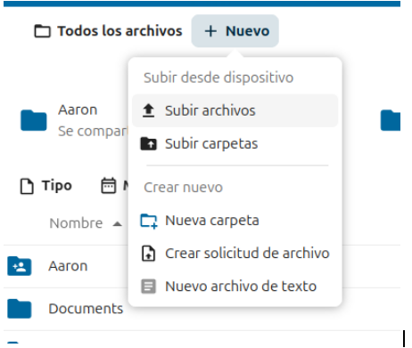

en la primera foto que tenemos lo que podemos ver esque para subir un archivo hay que darle al + y donde pone nuevo hay te saldra la opcion de subir archivo

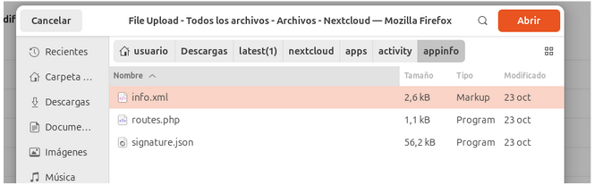

una vez haberle dado a subir el archivo eliges el archivo que quieras y le das a abrir

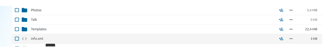

una vez dado y todo lo que he dicho antes el archivo que hayas seleccionado ya se habrá subido 

## creacion de carpeta

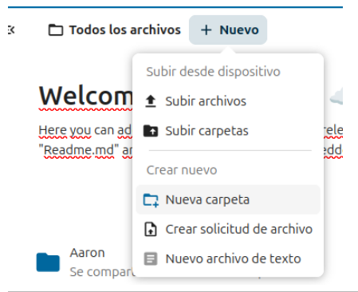

para crear una carpeta hay que hacer lo mismo que en lo de subir un archivo le damos al + nuevo y te saldrá la opción de crear nueva carpeta.

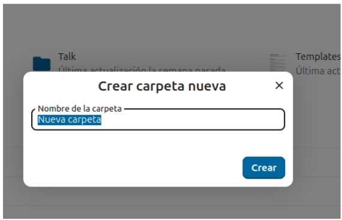

una vez le hayas dado te saldra esto y pones el nombre que tu desees 

una vez le hayas dado a crear la carpeta procede a crearla

una vez ya tengas la carpeta creada para compartirla le tendrás que dar a una persona que tiene un + arriba 

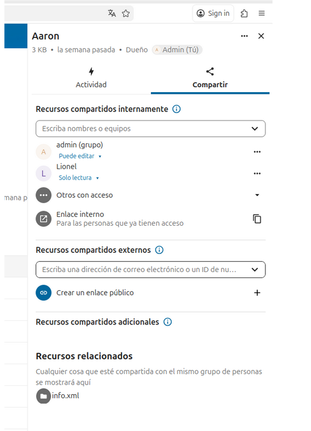

Una vez dado al más te saldra esto y aquí puedes compartirlo como tu desees o copiando el enlaçe y pasandolo o poniendo su correo electrónico pero se recomienda copiar el enlaçe y pasarlo

# 5 Creacion d'usuarios

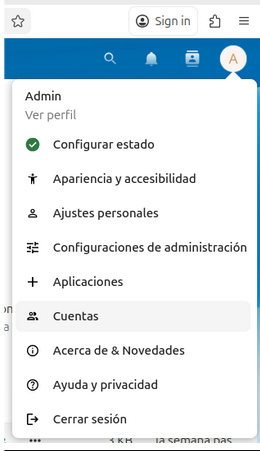

para  crear nuevos usuarios lo que hay que hacer es darle a tu perfil la letra que te salga arriba a la derecha y te saldra lo que ves ahora entonces tu le tendras que dar a cuentas .

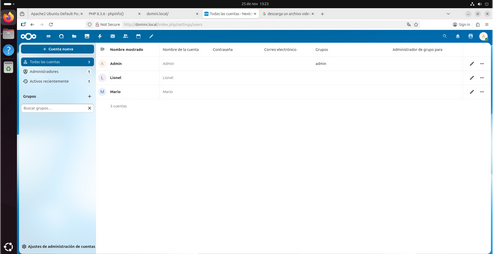

una vez dado a cuentas te meterá aquí yo ya tengo tres cuentas creadas pero te explicaré como crear una nueva cuenta.

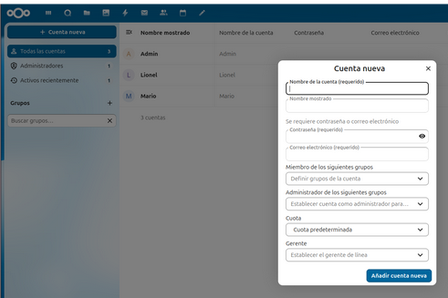

vale, una vez ya estés dentro le darás a donde poner crear una nueva cuenta, una vez le des te saldrá esto.

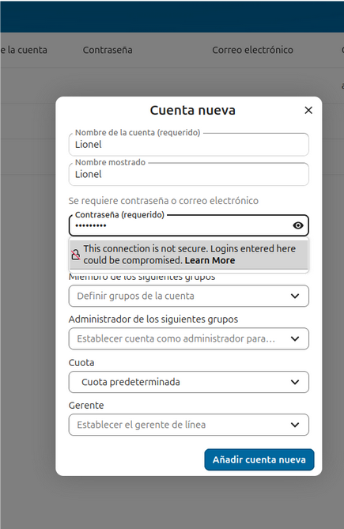

Cuando te salga esto solo lo tienes que llenar poner un correo si quieres no es necesario y una vez ya lo tengas le das añadir cuenta 

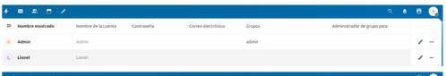

y una vez le des a añadir cuenta nueva ya se habrá creado tu cuenta como en mi caso que te he explicado como cree la cuenta de Lionel

